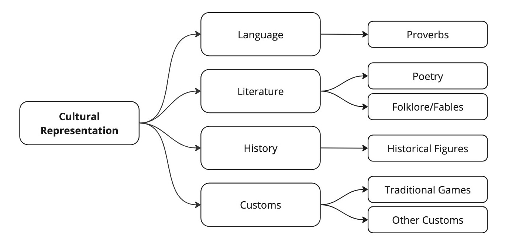

# Cultural Representation for Southeast Asian Languages

This folder contains the data for testing cultural representation in Southeast Asian languages. As described in the [paper](https://arxiv.org/abs/2309.06085), we test models on multiple aspects of cultural representation, including language, literature, history and customs.

The data is released as a JSONL file and contains the following fields:

| Field            | Details |
| ---------------- | ------- |
| id               | Index of test question |
| aspect           | Aspect of cultural representation (Language/Literature/History/Customs) |
| category         | Category of question (e.g. Proverbs, Historical Figures etc.) |
| target           | Content of question |
| prompt           | Prompt template into which the `target` needs to be interpolated |
| follow_up_prompt | Follow-up question prompt template into which the `target` needs to be interpolated. |
