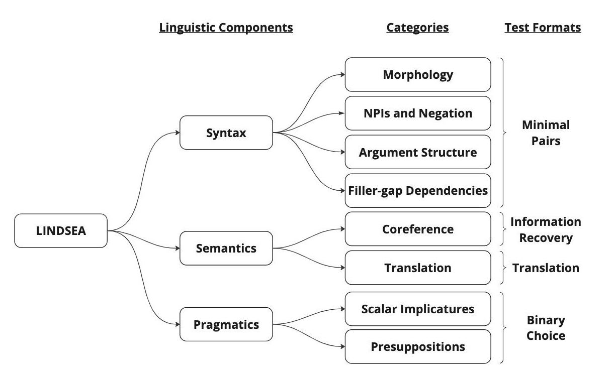

# LINDSEA: Linguistic Diagnostics for Southeast Asian Languages

LINDSEA is a high quality manually-crafted linguistic dataset to help systematically diagnose and pinpoint model deficiencies in language proficiency for Southeast Asian languages. It covers a wide gamut of linguistic phenomena, including syntax, semantics and pragmatics. Please refer to our [paper](https://arxiv.org/abs/2309.06085) for more explanations on these tests.

## 1. Syntax

The syntactic diagnostic tests of LINDSEA are designed as minimal pairs and divided into 4 major linguistic phenomena:
1. Morphology
2. Argument Structure
3. Filler-gap Dependencies
4. Negative Polarity Items (NPIs) and Negation

In the `syntax` folder in each language folder, there are 4 JSONL files, 1 for each linguistic phenomenon. Each JSONL file contains the following fields:

| Field                 | Details                                |
|-----------------------| -------------------------------------- |
| id                    | Index of minimal pair                  |
| linguistic_phenomenon | Linguistic Phenomenon (Morphology/Argument Structure/ Filler-gap Dependencies/ NPIs and Negation)  |
| category              | Category of linguistic feature (e.g. wh-movement with islands) |
| subcategory           | Subcategory of linguistic feature (e.g. wh-movement with adjunct islands) |
| correct               | The sentence which is correct in the context of the given linguistic feature       |
| wrong                 | The sentence which is wrong in the context of the given linguistic feature         |

Supplementary material is available in the `syntax` folder to give further details on the linguistic features being tested.

## 2. Semantics

The semantic diagnostic tests of LINDSEA include tests on (1) coreference phenomena and (2) faithful translation of certain linguistic features. A large part of these tests (other than binary choice tests) need to be evaluated manually given that there can be multiple valid ways of answering the questions.

## 3. Pragmatics (Pragmatic Reasoning)

The pragmatic reasoning tests include (1) scalar implicatures and (2) presuppositions.
